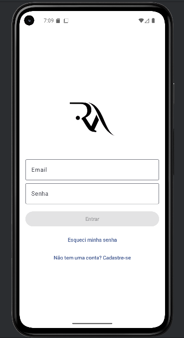
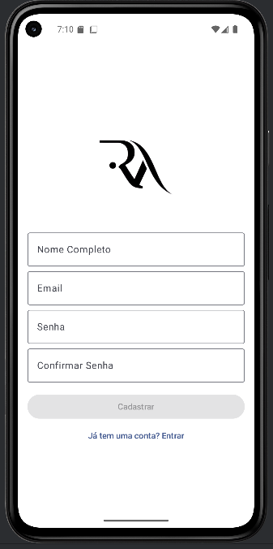
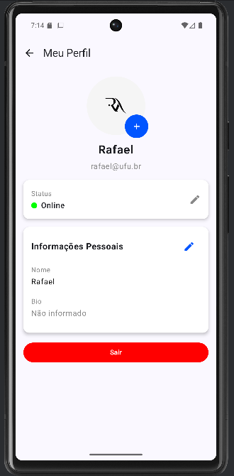
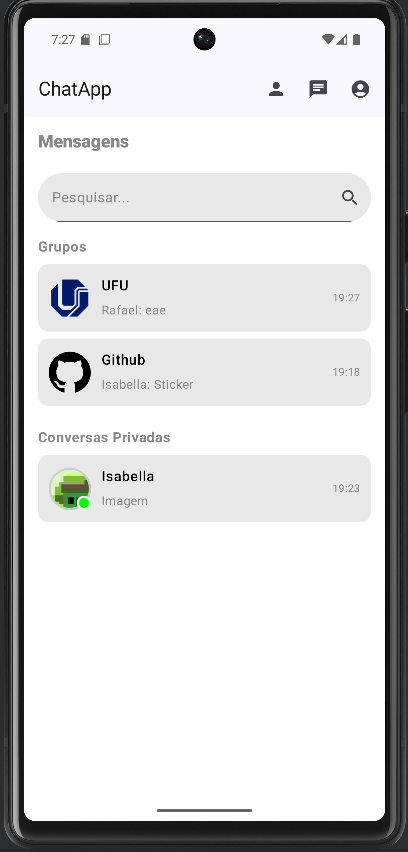
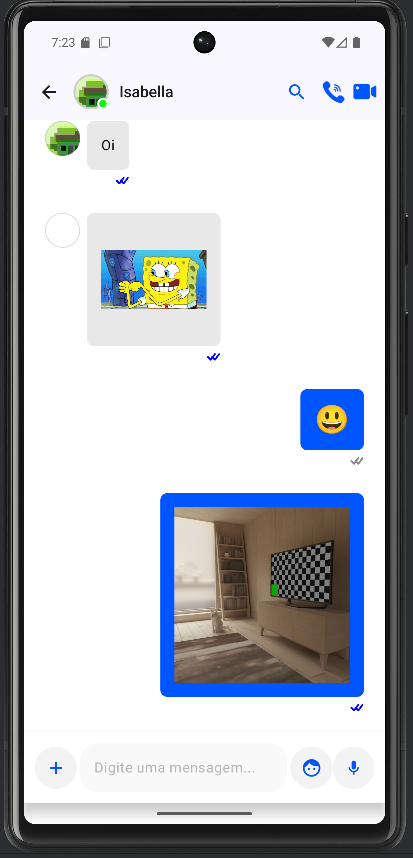
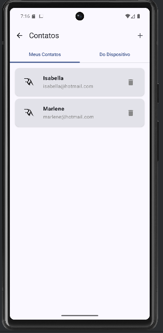
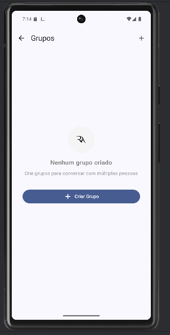
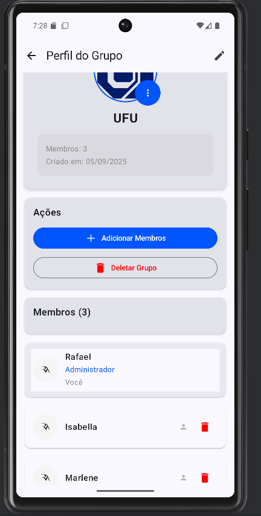
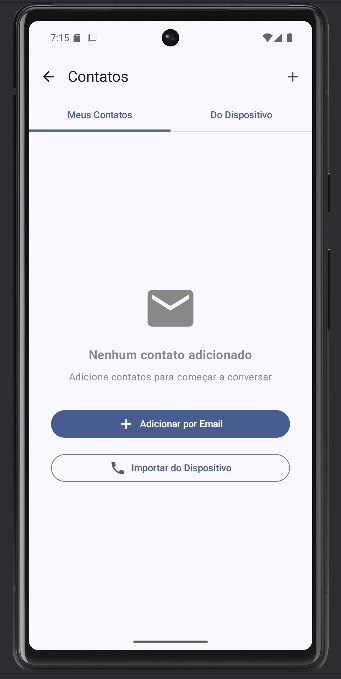
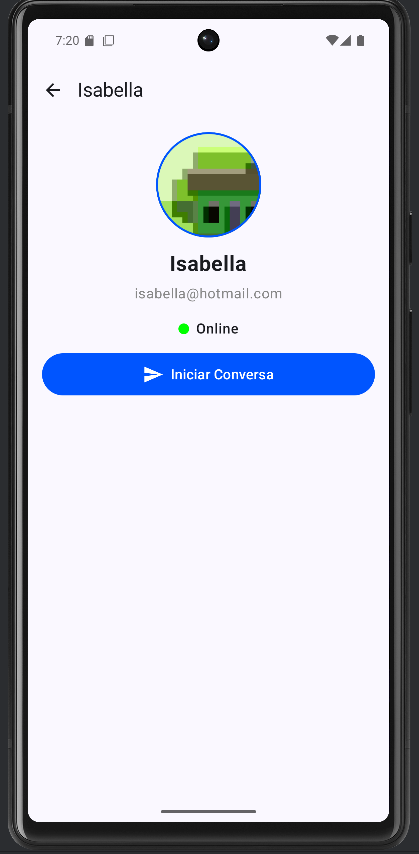

# 📱 ChatApp - Aplicativo de Mensagens Android

Aplicativo completo de mensagens instantâneas para Android, desenvolvido em **Kotlin** com **Jetpack Compose**. O projeto oferece comunicação em tempo real, suporte a múltiplos tipos de mídia e integração com diversas APIs modernas.

## � Screenshots

<div align="center">

### Autenticação e Perfil

  

### Chat e Conversas

  

### Grupos e Gerenciamento

  

### Perfis



</div>

## �🚀 Funcionalidades Implementadas

### 1. Cadastro e Autenticação de Usuário

- ✅ Login e cadastro via email/senha
- ✅ Recuperação de senha
- ✅ Autenticação persistente com Firebase Auth
- ✅ Gerenciamento de sessões seguras

### 2. Criação, Listagem e Busca de Conversas

- ✅ Visualizar lista de conversas/canais
- ✅ Busca rápida por contatos/conversas existentes
- ✅ Filtros inteligentes de conversas
- ✅ Ordenação por última mensagem

### 3. Envio e Recebimento de Mensagens

- ✅ Mensagens em tempo real (texto)
- ✅ Sincronização imediata entre dispositivos e usuários
- ✅ Confirmação de envio/recebimento (status: enviada, entregue, lida)
- ✅ Indicadores visuais de status das mensagens

### 4. Gerenciamento de Contatos

- ✅ Adicionar/remover contatos
- ✅ Importação de contatos do dispositivo
- ✅ Lista de contatos com status online/offline
- ✅ Busca de usuários por email

### 5. Criação e Gerenciamento de Grupos

- ✅ Criar grupos com múltiplos usuários
- ✅ Nomear/editar grupos
- ✅ Adicionar/remover participantes
- ✅ Perfil completo do grupo com foto
- ✅ Administração de grupos

### 6. Envio de Mídia

- ✅ Imagens, vídeos, áudios e arquivos anexos
- ✅ Visualização prévia de imagens e vídeos
- ✅ Gravação de áudio em tempo real
- ✅ Câmera integrada para fotos
- ✅ Suporte a múltiplos formatos de arquivo

### 7. Perfil do Usuário

- ✅ Editar nome, foto e informações pessoais
- ✅ Status do usuário (online/offline, ocupado, ausente, não incomodar)
- ✅ Bio personalizada
- ✅ Visualização de perfil de outros usuários

### 8. Interface de Chat Amigável

- ✅ Exibição de mensagens agrupadas por data/hora
- ✅ Bolhas de conversa com cores diferenciadas
- ✅ Avatares de usuário com status
- ✅ Suporte a emojis e stickers
- ✅ Design Material 3 moderno

### 9. Sincronização em Tempo Real e Offline

- ✅ Sincronização rápida entre dispositivos
- ✅ Armazenamento local para uso offline
- ✅ Atualização automática ao voltar online
- ✅ Firebase Realtime Database

### 10. Chamadas de Voz e Vídeo

- ✅ Chamadas individuais e em grupo
- ✅ Integração com ZegoCloud
- ✅ Interface de convite para chamadas
- ✅ Suporte a múltiplos participantes

### 11. Logout e Encerramento de Sessão

- ✅ Encerrar sessão de forma segura
- ✅ Gerenciar múltiplas sessões em diferentes dispositivos
- ✅ Limpeza de dados locais no logout

### 12. Notificações Push

- ✅ Notificações para chamadas de voz/vídeo
- ✅ Sistema FCM configurado
- ✅ Gerenciamento básico de notificações

### 13. Mensagens Fixadas

- ✅ Permitir que o usuário selecione uma mensagem importante e a fixe no topo do chat
- ✅ Ícone de fixar em cada mensagem
- ✅ Área no topo do chat para exibir mensagem fixada
- ✅ Opção para desfixar mensagens
- ✅ Indicador visual de mensagens fixadas

### 14. Filtro de Mensagens por Palavra-chave

- ✅ Campo de busca dentro da conversa
- ✅ Filtrar mensagens que contenham palavra/expressão específica
- ✅ Destacar texto encontrado nas mensagens
- ✅ Busca em tempo real conforme o usuário digita
- ✅ Navegação entre resultados encontrados

## 🛠️ Tecnologias Utilizadas

### Frontend

- **Kotlin** - Linguagem principal
- **Jetpack Compose** - Interface moderna e declarativa
- **Material Design 3** - Sistema de design
- **Navigation Compose** - Navegação entre telas
- **Dagger Hilt** - Injeção de dependências

### Backend e Serviços

- **Firebase Authentication** - Autenticação
- **Firebase Realtime Database** - Banco em tempo real
- **Firebase Cloud Messaging** - Notificações push
- **Firebase Storage** - Armazenamento de arquivos
- **Supabase Storage** - Storage alternativo para mídias
- **ZegoCloud** - Chamadas de voz/vídeo

## ⚙️ Configuração e Instalação

### Pré-requisitos

- Android Studio Arctic Fox ou superior
- SDK Android 26+ (Android 8.0)
- Conta Firebase
- Conta Supabase
- Conta ZegoCloud

## 🔐 Segurança e Configuração de Credenciais

⚠️ **IMPORTANTE**: Este projeto contém arquivos de exemplo para proteger dados sensíveis.

### Arquivos que você precisa configurar:

1. **Copie e configure os arquivos de exemplo:**

   ```bash
   # Copie os arquivos de exemplo
   cp app/google-services.json.example app/google-services.json
   cp app/src/main/java/com/example/chatapp/Const.kt.example app/src/main/java/com/example/chatapp/Const.kt
   ```

2. **Nunca commite os seguintes arquivos:**

   - `app/google-services.json` (contém credenciais Firebase)
   - `app/src/main/java/com/example/chatapp/Const.kt` (contém credenciais ZegoCloud)
   - Qualquer arquivo `.keystore` ou `.jks`

3. **Configure suas credenciais nos arquivos apropriados seguindo as instruções abaixo.**

### 1. Configuração do Firebase

#### 1.1. Criar Projeto Firebase

1. Acesse [Firebase Console](https://console.firebase.google.com/)
2. Clique em "Adicionar projeto"
3. Nomeie o projeto como "ChatApp"
4. Ative o Google Analytics (opcional)

#### 1.2. Configurar Authentication

1. No console Firebase, vá para "Authentication" > "Sign-in method"
2. Ative "Email/Password"
3. Configure domínios autorizados se necessário

#### 1.3. Configurar Realtime Database

1. Vá para "Realtime Database" > "Criar banco de dados"
2. Escolha localização (preferencialmente próxima aos usuários)
3. Configure as seguintes **Rules de Segurança**:

```json
{
  "rules": {
    ".read": "auth != null",
    ".write": "auth != null",
    "users": {
      ".indexOn": "email"
    }
  }
}
```

#### 1.4. Configurar Cloud Messaging

1. Vá para "Cloud Messaging"
2. Gere uma nova chave do servidor
3. Configure as configurações do FCM

#### 1.5. Configurar Storage

1. Vá para "Storage" > "Começar"
2. Configure as regras de segurança:

```javascript
rules_version = '2';
service firebase.storage {
  match /b/{bucket}/o {
    match /{allPaths=**} {
      allow read, write: if request.auth != null;
    }
  }
}
```

#### 1.6. Baixar google-services.json

1. Vá para "Configurações do projeto" > "Seus aplicativos"
2. Clique em "Adicionar app" > Android
3. Registre o app com o package name: `com.example.chatapp`
4. **IMPORTANTE**: Cole o **SHA-1** do seu certificado de debug:
   ```bash
   # Para obter o SHA-1:
   keytool -list -v -keystore ~/.android/debug.keystore -alias androiddebugkey -storepass android -keypass android
   ```
5. Baixe o arquivo `google-services.json`
6. Coloque em `app/google-services.json`

### 2. Configuração do Supabase

#### 2.1. Criar Projeto Supabase

1. Acesse [Supabase](https://supabase.com/)
2. Crie uma nova organização e projeto
3. Anote a URL e a chave anon do projeto

#### 2.2. Configurar Storage Buckets

1. Vá para "Storage" no dashboard Supabase
2. Execute o script `create-buckets.sql` no SQL Editor:

```sql
-- Criar buckets para diferentes tipos de mídia
insert into storage.buckets (id, name, public) values ('chatapp_images', 'chatapp_images', true);
insert into storage.buckets (id, name, public) values ('chatapp_videos', 'chatapp_videos', true);
insert into storage.buckets (id, name, public) values ('chatapp_audios', 'chatapp_audios', true);
insert into storage.buckets (id, name, public) values ('chatapp_files', 'chatapp_files', true);

-- Políticas de acesso público
create policy "Public Access" on storage.objects for select using (bucket_id in ('chatapp_images', 'chatapp_videos', 'chatapp_audios', 'chatapp_files'));
create policy "Public Upload" on storage.objects for insert with check (bucket_id in ('chatapp_images', 'chatapp_videos', 'chatapp_audios', 'chatapp_files'));
create policy "Public Update" on storage.objects for update using (bucket_id in ('chatapp_images', 'chatapp_videos', 'chatapp_audios', 'chatapp_files'));
create policy "Public Delete" on storage.objects for delete using (bucket_id in ('chatapp_images', 'chatapp_videos', 'chatapp_audios', 'chatapp_files'));
```

#### 2.3. Configurar Credenciais

1. Abra `SupabaseStorageUtils.kt`
2. Substitua a URL e chave pelos seus dados:

```kotlin
val supabase = createSupabaseClient(
    "SUA_URL_SUPABASE_AQUI",
    "SUA_CHAVE_ANON_AQUI"
)
```

### 3. Configuração do ZegoCloud

#### 3.1. Criar Conta ZegoCloud

1. Acesse [ZegoCloud Console](https://console.zegocloud.com/)
2. Crie uma conta e novo projeto
3. Vá para "Projects" > "Manage"

#### 3.2. Obter Credenciais

1. Na seção "App Information", copie:
   - **AppID** (número)
   - **AppSign** (string)

#### 3.3. Configurar no App

1. Abra `Const.kt`
2. Substitua as credenciais:

```kotlin
val AppID: Long = SEU_APP_ID_AQUI
val AppSign = "SEU_APP_SIGN_AQUI"
```

### 4. Configuração de Emuladores (Opcional)

Para configurar múltiplos emuladores Android:

1. Execute o PowerShell como Administrador
2. Rode o script de configuração:
   ```powershell
   .\setup-emulators.ps1
   ```

Este script configura automaticamente:

- DNS dos emuladores
- Conectividade de rede
- Configurações de múltiplos emuladores

### 5. Executar o Projeto

1. Clone o repositório:

   ```bash
   git clone https://github.com/AlonsoRafael/AndroidStudio_ChatApp.git
   ```

2. Abra o projeto no Android Studio

3. Certifique-se de que todas as configurações estão corretas

4. Execute o projeto em um dispositivo ou emulador

## 📱 Permissões Necessárias

O app solicita as seguintes permissões:

- `INTERNET` - Conectividade
- `CAMERA` - Câmera para fotos/vídeos
- `RECORD_AUDIO` - Gravação de áudio
- `READ_CONTACTS` - Lista de contatos
- `READ_MEDIA_*` - Acesso à galeria
- `SYSTEM_ALERT_WINDOW` - Overlays de chamada

## 🎯 Estrutura do Projeto

```
app/src/main/java/com/example/chatapp/
├── feature/
│   ├── auth/          # Autenticação (login, registro, recuperação)
│   ├── chat/          # Tela de chat e funcionalidades
│   ├── home/          # Tela principal
│   ├── profile/       # Perfis de usuário
│   ├── groups/        # Gerenciamento de grupos
│   ├── contacts/      # Lista de contatos
│   └── notifications/ # Sistema de notificações
├── model/             # Modelos de dados
├── config/            # Configurações Firebase
├── manager/           # Gerenciadores (status, etc.)
├── ui/                # Componentes de interface
└── utils/             # Utilitários
```

## 🤝 Contribuição

1. Faça um fork do projeto
2. Crie uma branch para sua feature (`git checkout -b feature/AmazingFeature`)
3. Commit suas mudanças (`git commit -m 'Add some AmazingFeature'`)
4. Push para a branch (`git push origin feature/AmazingFeature`)
5. Abra um Pull Request

## 📄 Licença

Este projeto está sob a licença MIT. Veja o arquivo [LICENSE](LICENSE) para mais detalhes.

## 📞 Contato

Rafael Alonso - [@AlonsoRafael](https://github.com/AlonsoRafael)

Link do Projeto: [https://github.com/AlonsoRafael/AndroidStudio_ChatApp](https://github.com/AlonsoRafael/AndroidStudio_ChatApp)
